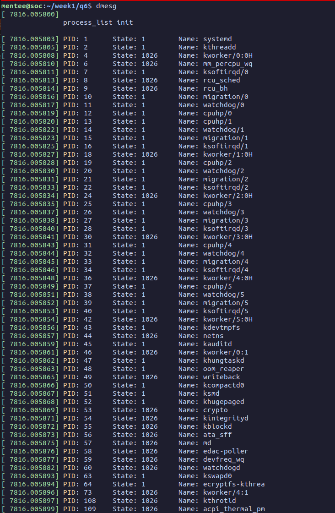
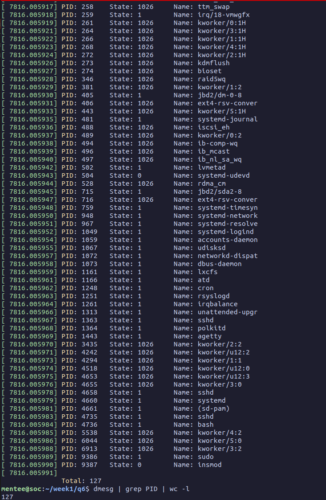

# 1. \proc

## a.

A core is a physical processing unit, processor is a logical processing unit.

Basically, a core is the number of physical processing units are there,
but each physical core has hyperthreading which allows it to somehow multitask upto two "threads".  
this allows a physical core to be divided into upto two logical cores, which are the processors.

In my physical machine,

- There are 10 cores (ids: 0, 4, 8, 12, 16, 20, 24, 25, 26, 27)
- But 16 processors (core ids 0, 4, 8, 12, 16, 20 are repeated)
- This is possible coz in lscpu it shows 2 threads per core, hence each core can be used in upto two processors

In my VM, there are 6 cores, 6 processors, 1 thread per core

---

## b.

Number of cores in VM: 6

Method:

```bash
lscpu | less
```

Core(s) per socket:  6  
Socket(s):           1

Cores = 6 * 1

### OR

```bash
cat /proc/cpuinfo | grep "cpu cores"
```

cpu cores       : 6

---

## c.

Number of processors in VM: 6

Method:

```
lscpu | less
```

CPU(s):              6

### OR

```bash
cat /proc/cpuinfo | grep "processor"
```

you can see processors 0 to 5

---

## d.

Frequency of each processor in VM: 2918.398 MHz

Method:

```bash
lscpu | less
```

CPU MHz:             2918.398

### OR

```bash
cat /proc/cpuinfo | grep "cpu MHz"
```

cpu MHz        : 2918.398

---

## e.

Architecture of CPU in VM: x86_64

Method:

```bash
lscpu | less
```

Architecture:        x86_64

---

## f.

Physical memory in VM: 4040256 kB

Method:

```bash
less /proc/meminfo
```

MemTotal:        4040256 kB

### OR

```bash
lsmem
```

Total online memory:     4.1G (DOUBT: idk why its slightly different, especially slightly higher)

---

## g.

Free memory in VM: 3587208 kB

Method:

```bash
less /proc/meminfo
```

MemFree:         3587208 kB

---

## h1.

Forks in VM: 3226

Method:

```bash
vmstat -f
```

(the processes field in `/proc/stat` gives forks + clones, so its slightly higher)

---

## h2.

Context switches in VM: 394774

Method:

```bash
vmstat -s | grep "CPU context switches"
```

394774 CPU context switches

### OR

```bash
cat /proc/sched_debug | grep nr_switches
```

#### context switches for each CPU:

.nr_switches                   : 173949  
.nr_switches                   : 29656  
.nr_switches                   : 27447  
.nr_switches                   : 89857  
.nr_switches                   : 20355  
.nr_switches                   : 53688  
SUM = 173949 + 29656 + 27447 + 89857 + 20355 + 53688 = 394952 (slightly different due to time difference)

---

# 2. top

## a.

PID: 3366

## b.

100% CPU  
this is a single (logical) CPU, overall CPU% is 16.6% - 16.7% (can be seen by pressing shift+I while using `top`)  
also, `htop` can be used to see that exactly one processor is at 100% and the rest is < 1%

0% MEM  
4384 KiB Virtual Memory  
808 KiB Physical Memory

## c.

Running state (R)
(If ctrl+Z is done, you can see the state change to Stopped (T))

---

# 3. Memory

## memory1

Virtual Memory: 8300 KiB  
Physical Memory: 756 KiB

## memory2

Virtual Memory: 8300 KiB  
Physical Memory: 3296 KiB

If we make memory3, which is memory2 modified to use the full array...

## memory3

Virtual Memory: 8304 KiB  
Physical Memory: 5356 KiB

## calculations

ARRAY_SIZE = 1000000  
size in bytes = 1000000 * 4 = 4,000,000  
size in KiB = 4000000 / 1024 = 3906  
size of half the array = 1953  
memory3 - memory2 = 2060  
memory2 - memory1 = 2540  
DOUBT: memory(3 - 2) is approx same as half the array, but why is memory(2 - 1) 500KiB more

---
# q6

## Starting


## Ending + Verification of total

