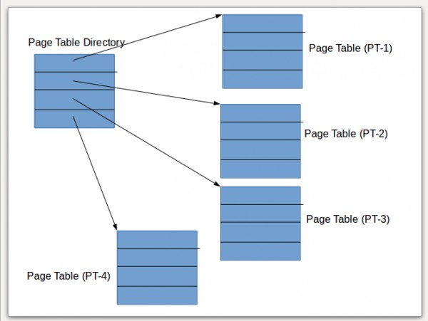

# Page Table Walker Simulation

This project implements a simplified Memory Management Unit (MMU) that translates virtual addresses into physical addresses using a multi-level page table. It is written in C++ and is configurable for different address widths, page sizes, and page table depths.

**The first and the last sections of the how to implement part are mandatory.**

**If you are aware of how a page table walker is done, you are expected to write a custom memory allocator as mentioned in the week-3 README.md. At least a custom memory allocator is expected(need not be thread-safe)**
---
Deadline: 27th June 2025

Note: The numbers used for addresses as examples are decimal. If you have any doubts reach out to us!

## Files and Structure

```
.
├── MMU.hpp         # For VA to PA translation
├── Memory.hpp      # Models the physical memory 
├── Config.hpp      # System configuration
├── README.md       # This file
```

---

## Configuration (`Config.hpp`)

The `Config` struct defines how the virtual address space is divided:

```cpp
struct Config {
    int addressWidth;     // Total virtual address 
    int pageSize;         // Page size in bytes
    int pageTableLevels;    // Number of levels
    std::vector<int> bitsPerLevel; // Number of bits used per level of translation
};
```

Example: For a 32-bit address space with 2 levels:

```cpp
Config cfg = {
    .addressWidth = 2,
    .pageSize = 4096, (12 bits)
    .pageTableLevels = 2,
    .bitsPerLevel = {10, 10} // 10 + 10 + 12 = 32
};
```

---

## Memory System (`Memory.hpp`)

### PageTableEntry

```cpp
struct PageTableEntry {
    uint64_t physicalFrame;  // Physical frame number for the next level or final data page

    // Optional to implement
    bool present;            // Is page is valid
    bool user;               // Is page user-accessible
    bool write;              // Is page writable
};
```

### Memory Class Overview

- Page tables are modeled as a vector of hash maps, one per level.
- Memory contents are stored separately in a `memory_contents` map.

Key functions:
```cpp

// It's always useful to write abstractions
void setPageTableEntry(uint32_t level, uint32_t index, const PageTableEntry& entry);
PageTableEntry getPageTableEntry(uint32_t level, uint32_t index) const;

```

---

## Address Translation (`MMU.hpp`)

The `MMU` class translates a given virtual address using the page table structure.

```cpp

class MMU {
public:
    MMU(const Memory& memory, const Config& cfg);
    // we expose only these objects and methods to the user
    void storeVal(uint64_t vaddr, uint64_t val); 
    uint64_t loadVal(uint64_t vaddr);

private:
    const Memory& mem;
    uint64_t translate(vaddr);
    const Config& config;
};
```


## How to go about implementing

**Write your solution in Memory.cpp and MMU.cpp(implementations of the above method). You can also submit the main.cpp you have used to test your implementation. **
This is a mandatory part of the assignment.

Your inputs would be Load and Store requests, which are basically the user telling, "Hey, put this value at this particular spot and map this id to it so that I can retrive it later if I want to".

Let's say a user issues a store request. They give you the virtual address, and they give you the value. 

First, we have to figure out where to store this in actual memory. 
We'll start with one level of page table. Figure out the page size. Usually its around 4KB. Set the remaining bits as those being used for translation. Now, use setPageTableEntry to add a VA --> PA mapping. As for which PA, there's a field called ```nextAvailableFrame``` which tells you which page in physical memory is free next. Use that to allot the VA --> PA translation(don't forget to increment it!)

So, this is done in the Page table. So, after this, you should be able to retrieve the physical address given the virutal address. After this, you simply store the val in the unordered_map.

If the user issues a load request, you ignore the last PAGE_SIZE bits(here its 12), and look into the first level. You then get the physical address and return the corresponding value. If the address doesn't have a mapping, you have to raise an Exception by using ```throw``` and catch it in main.cpp. Look up types of errors for more detail.


### Let's go on the next level(no pun intended)

This section is not how usually Multi-level Paging works. So, this is optional.

Now, we'll move on to implementing a multi-level page table. This can be a bit confusing, so hold on. 

Similar input. User gives you a store request of a vaddr and a val. Figure out Page sizes and bits you'll use per level. Then, take the corresponding bits and look up in the corresponding levels. I'll elaborate.


Let's say you use 10 + 10 + 12 as your scheme. If I give you a 32 bit virtual address(which by the way is good to have a check for!), I'll take the first 10 bits, look up in the first level, get a corresponding frame. Next 10 bits in the next level and get the corresponding frame. 

Let's say I give you a virtual address ```245 | 108 | 2431``` (broken apart into ```10 | 10 | 12``` bits). You'll look up 245 in first level(say you get 003), 108 in the second level(say you get 120). With this you do ```003 | 120 | 2431```. Notice that the offset within the page(the last 12 bits) remains the same.

Now that you have the physical address, you can go ahead and store the value :))

Same goes for loading.


### Not challenging enough?

Note: This section is optional

You've learnt about TLBs right? Let's try to implement them. You would have to write the class declaration in `TLB.h`. This would be a container(like a map), which maps the Virtual Page number to Physical frame number. Every single time you go through each level, you check if its present in TLB, if yes, you return the corresponding Physical frame number and if not you insert it. But alas! TLB is very limited in space and most of the time you would have to evict things out. You can evict the first that came in or Least frequently used(this is often easier, just maintain counts for each(psst... use sets)). 

To ensure it is working, have add a variable in `MMU.h` to count number of traversals to each levels that you're doing(basically when you go to the next level after a TLB miss, increment this count). Report with and without using the TLB.


### The MMU we have at home:

This section is mandatory.

NOTE: In this part, you're not allowed to use the `pageTable` in the Memory class. Everything must be done through ```memory_contents```

So far we've been doing the equivalent of "But we have a MMU at home". 

Let's use `memoryContents` for paging in itself, because hey, OS doesn't have a specific space where you store Page tables


Yep, we're gonna do everything with pages!

For this first create a variable in your MMU called `CR3` which will store the absolute start of the outer page directory.

So, let's say that you want to translate ```245 | 108 | 2431``` based on `10 | 10 | 12`. I'll tell you the good news first of all. The page offset still remains. So you can a just append that guy at the end of the final translation

---
## How Translation Works

1. The virtual address is split into:
   * Offset bits (based on `pageSize`)
   * One index per level (based on `bitsPerLevel`)
2. The `MMU` walks through the page table levels using the indices.
3. If any level's entry is not present, translation fails.
4. If successful, the final physical address is:
   ```
   (last level physicalFrame << offsetBits) | offset
   ```
---


Let's start. So, the first set of bits you have - that is your offset into your first level of page table. Recollect that you can think of Page Tables as arrays and how for indexing arrays you just need the start pointer(why int a[] and int * a both work remember?). Since you know the absolute start - this is CR3 - you offset CR3 by 245 and see what's in there. 

Wanna take a quick guess what will be there?

It will have the page of the next level. Pop quiz. Would this address that I get be divisible by Page_size? 
<details>
  <summary style="font-size: 17px;"><b>Think before you open this!</b></summary>
Yessir

</details> 
‎



You would have to allocate a page from the `nextAvailablePage` if that part of the page says invalild implying that a corresponding page is not allocated. If that is done, you go to that new address and offset with 108, get the corresponding address and voila! You have your final frame number, lets say p.

Final physical address would be p << 22 + 2431 and you do a... store yes, I almost forgot what we were doing this for.

Similarly load.

There's more scope to do things here though. You can set valid bit which says whether the pagetable entry is valid or not. (By the way you will have to figure out a smart way to compact physical frame number and all these permissions). So, if I ask for a load access, but its invalid, you throw. 

<details>
  <summary style="font-size: 17px;"><b>Hint</b></summary>
Are we using the last 12 bits in this case for anything at all? If not, why not?

</details> 

Similarly, if its not a user page, but the user asks for it, throw. If its a read-only page, but the user writes onto it, what do you do? You throw without hesistating. At this rate you're throwing, you'll get into NBA in no time.


That's about it, but reach out to me if you wanna do more!


